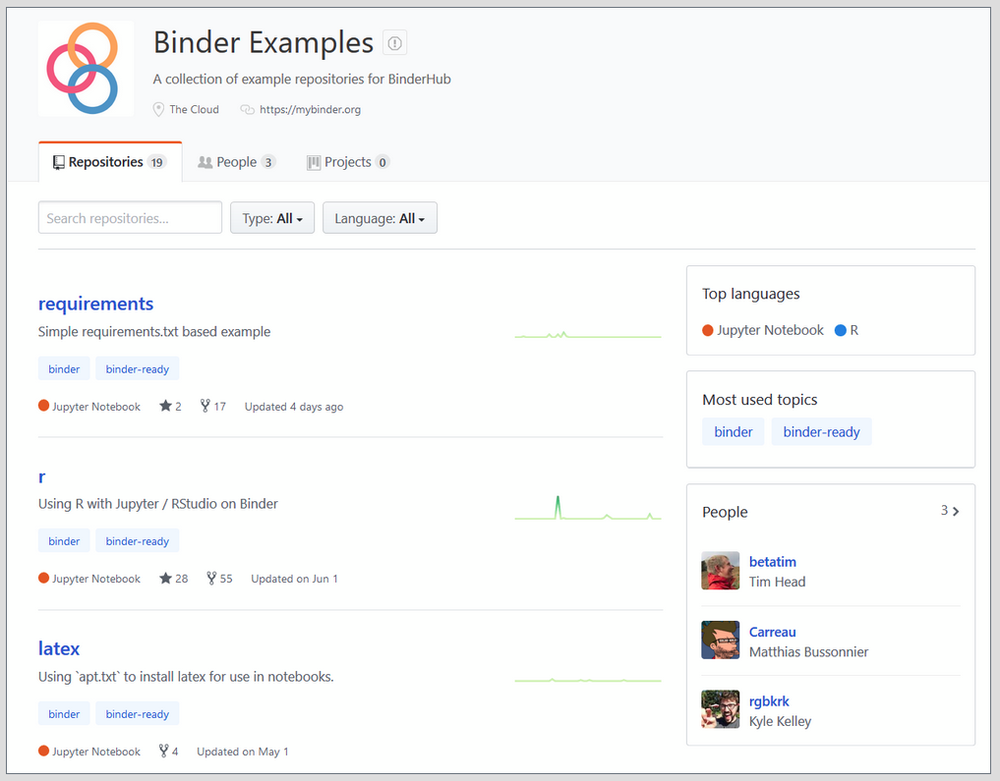
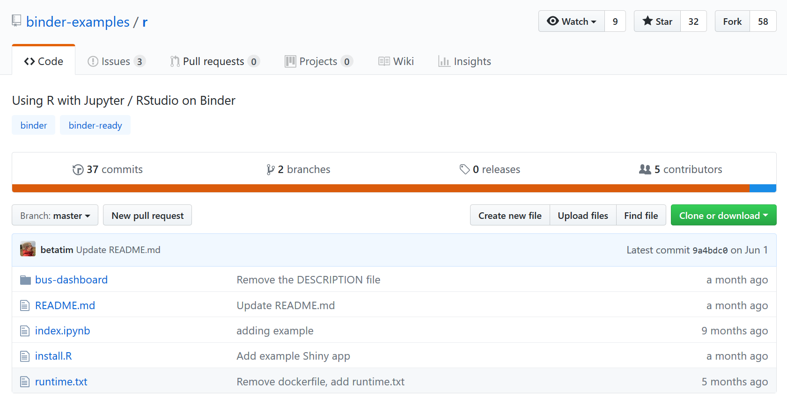
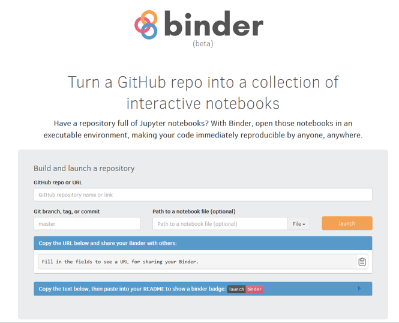
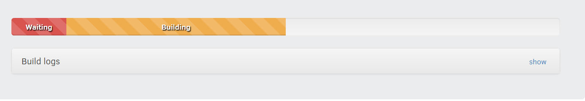
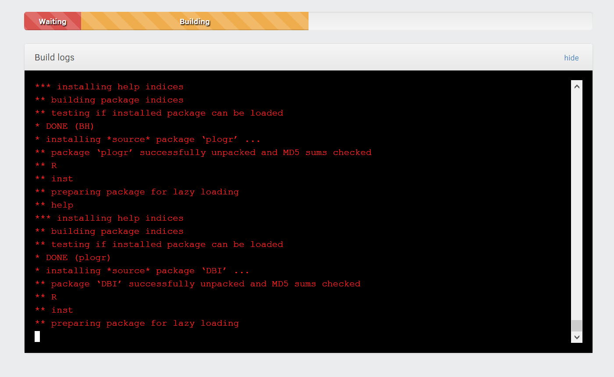
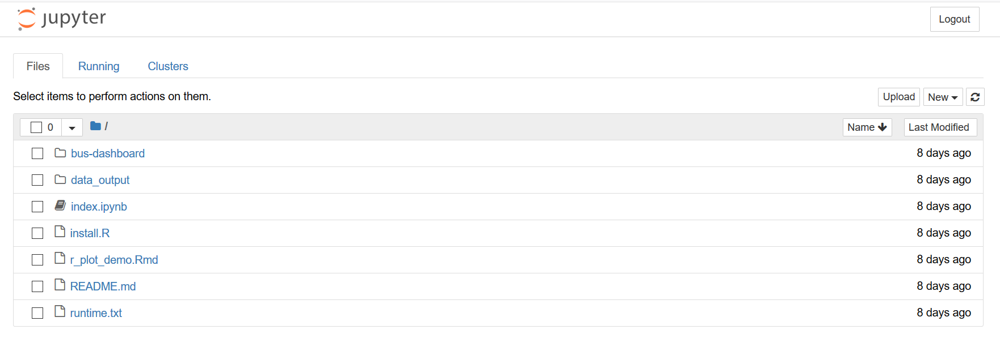
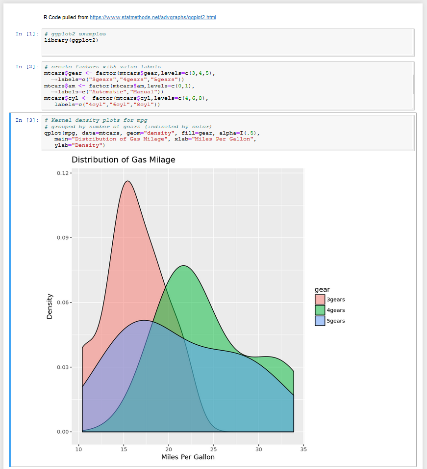

# Making your first Binder
*A collaborative document*

### Contents 
- [Motivation](https://github.com/dmgt/binder_tutorial/blob/master/tutorial.md#motivation)
  - Why might I want to use it?
  - What is Binder? 
- [Making a Binder](https://github.com/dmgt/binder_tutorial/blob/master/tutorial.md#making-a-binder-based-on-a-fork-of-an-existing-binder-template)
  - Example 1: Making a Binder based on a fork of an existing Binder template
  - TODO Example 2: Adding some data to the example Binder
  - TODO Example 3 -  Making a Binder based on an existing repo of your own, from scratch
   
### Motivation

#### Why might I want to use it? 

 - When do you use a binder? Running code from Github without having to download Python or R to create the Jupyter or RStudio environment (eg teaching a large class using RStudio without having to have all students download various versions of R)
    - If you know how to use git, clone the repo and make edits on git. If you don't know how to use git, you can use binder to manipulate data 
    - Why do we use containers? Creating a setting in which all computer architecture is equalized, variable hardware from person to person will not affect the memory allocated for calculations, which could effect data analysis 
- "Freezing" and sharing a rendered version of a research compendium being entered into the scholarly record so that reviewers, readers, and possible reusers may evaluate the findings 

#### What *is* Binder?
   - Paraphrasing [Carol's summary](https://hackmd.io/s/S1fWYzBfQ#): it's a service, a way to display your work (eg with Jupyter notebooks or R Shiny), a clickable badge you can get for a GitHub repo, and a project you can deploy 
   - A [diagram](https://github.com/dmgt/binder_brainstorming/blob/master/binder_diagram_draft.pdf) targeting novices 
        - novice gave feedback this still assumed things they hadn't seen before eg what is a container anyway?
   - [Official diagram](http://binderhub.readthedocs.io/en/latest/overview.html) from documentation


### Making a Binder based on a fork of an existing Binder template 
#### Example 1 - exactly replicating the example Binder [Tommy]

1. Register for a [GitHub](https://github.com/) account if you do not have one.
2. Go to the [binder-examples](https://github.com/binder-examples/r) GitHub repo and click on one of the examples eg `r` or `jupyterlab`

     
    
3. Click the grey "Fork" button on the top-right corner of the page, which will create your own copy of the repo under your own GitHub account.  
    
    

4. Go to the [mybinder](https://mybinder.org/) website, copy the url of your forked repository `https://github.com/yourusername/r` and paste it under the `GitHub repo or URL` section.

    
    
 You can leave the `Git branch, tag, or commit`  and `Path to a notebook file` options blank

5. . When you click `launch`, Binder will start building what's called an *image* that contains all of the code and data and required software specified in the example repository you forked. This will probably take a while - eg 10 minutes.  

    
    
    If you want to see what is happening, click 'show build logs'

    

  
7. When the Binder opens, by default you will see a Jupyter file browser.
The image below shows a Binder from the r example page shown above.
  
    
    
8. Click on the `.ipynb` file to open it - now you can interact with the code in your Browser, while it runs on a remote computer, thanks to Binder! Note that this instance is ephemeral and will time out after about an hour (or less) if it is not used.

    

9. If you want to open an RStudio session or R shiny app, then go back to your own github page `https://github.com/yourusername/r`, edit the `README.md`. 
 
change 
```
Jupyter+R: [](http://beta.mybinder.org/v2/gh/binder-examples/r/master?filepath=index.ipynb)

RStudio: [](http://beta.mybinder.org/v2/gh/binder-examples/r/master?urlpath=rstudio)

RShiny: [](http://beta.mybinder.org/v2/gh/binder-examples/r/master?urlpath=shiny/bus-dashboard/)
```

   to
   
```
Jupyter+R: [](https://mybinder.org/v2/gh/yourusername/r/master?filepath=index.ipynb)

RStudio: [

RShiny: [](https://mybinder.org/v2/gh/yourusername/r/master?urlpath=shiny/bus-dashboard/)
```
click `commit changes`, now you can click the badges to open your own binder in jupyter notebook, Rstudio session and R shiny app :) 

You can also directly try opening a url containing `urlpath=rstudio` , eg <https://mybinder.org/v2/gh/yourusername/r/master?urlpath=rstudio>

 


### Example 2 - adding some data to the example Binder 


### Example 3 -  Making a Binder based on an existing repo of your own, from scratch
- TODO: R example
    - Example from Hao: https://github.com/ha0ye/Power_of_Irma
- TODO: Python example


###  Making a binder of a research compendium that exists as a GitHub repo, for review and evaluation purposes
- there are examples of such in the published literature that we can point to. This example might also include how to reposit and get the DOI for the object.
